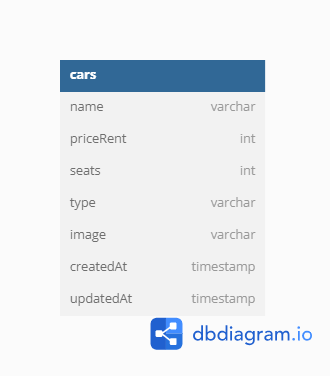

### Entity Diagram

<h1 align="center">
  
</h1>

### This app running on port 8000

### API
View:

=> localhost:8000/dashboard =  Get all data from database and show in dashboard

=> localhost:8000/create (GET METHOD) = GET requests to render create car page

=> localhost:8000/create (POST METHOD) = POST requests to create a new car

=> localhost:8000/edit (GET METHOD) = GET requests to render edit car page

=> localhost:8000/edit (POST METHOD) = POST requests to edit a car

=> localhost:8000/delete/:id  (GET Method) = GET request for delete confirmation page

Backend:

=> localhost:8000/api/v1/car (GET METHOD) = GET requests to retrieve all cars

=> localhost:8000/api/v1/car (POST METHOD) = POST requests to create a new car

=> localhost:8000/api/v1/car/:id (GET METHOD) = GET requests to retrieve a car by ID

=> localhost:8000/api/v1/car/:id (PATCH METHOD) = PATCH requests to update a car

=> localhost:8000/api/v1/car/:id (DELETE METHOD) = DELETE requests to delete a car
